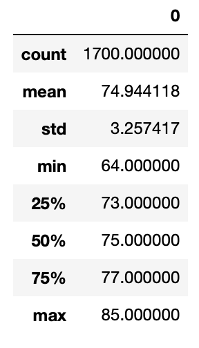
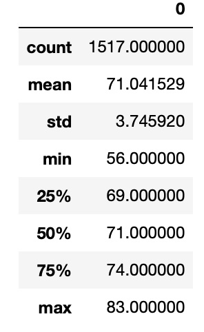

# surfs_up

## Overview 

The purpose of this project is to analyze the weather of Oahu, Hawaii in order to determine if a surf shop business will be sustainable year round before opening a shop in this location. 

## Results 

A summary analysis of Oahu weather resulted in these statistics for June: 

And these statistics for December: 

## Summary

